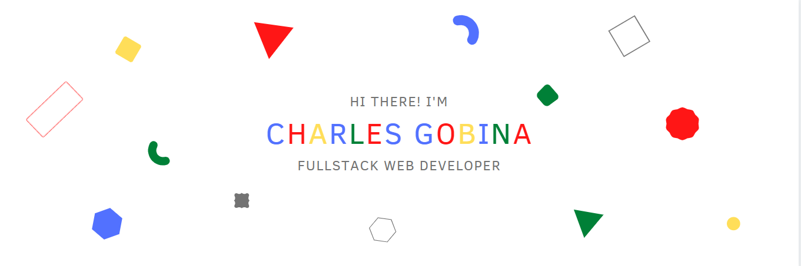

  

  
  

### About me  
- 🔭 I’m currently a [Micronaut](https://www.microverse.org/)  
  

- 🌱 I’m currently learning Hyperledger and Kubernetes  
  

- ❓ Ask me about anything related to MERN stack and related technologies  
  

- ⚡ Fun fact: I use tabs over spaces  
  

   

## Connect with me  

  

 

## My Skill Set  
<table width="100%">
  <tr>
    <td style="width:33.3%">
      
  
        
        
        
        
      

    </td>
    <td style="width:33.3%">
      
  
        
        
      
    
    </td>
    <td style="width:33.3%">
        
        
    </td>
  </tr>
</table>

<table style="width:100%">
  <tr>
    <td style="width:50%">
      
    </td>
    <td style="width:50%">
         
    </td>
  </tr>
</table>

   

   

## Listening to on Spotify  
  

   

  
  

   

 

----

Generated using <a href="https://profilinator.rishav.dev/" target="_blank">Github Profilinator</a>

